# 0.Pre Flight
## Gaining Acces
Upon opneing the ArchivesSpace software/program, the user will be met with a login screen asking for their credentials.
Asucessful login should give access to the software and the user will be presented with the ArchivesSpace main page with "**DEV SITE**" Being the first thing they see.

---

# 1. Working with Collections and Items
## 1.1.Selecting a Collection
After the logining in. Go to the search bar and type in the **_key word_** to search for your desired collection.
- What is a key word?
A key word is used to search for items and collections in Archives Space. Think of it as a tag to filter search results. Only items that are similar to the key word will appear in the results

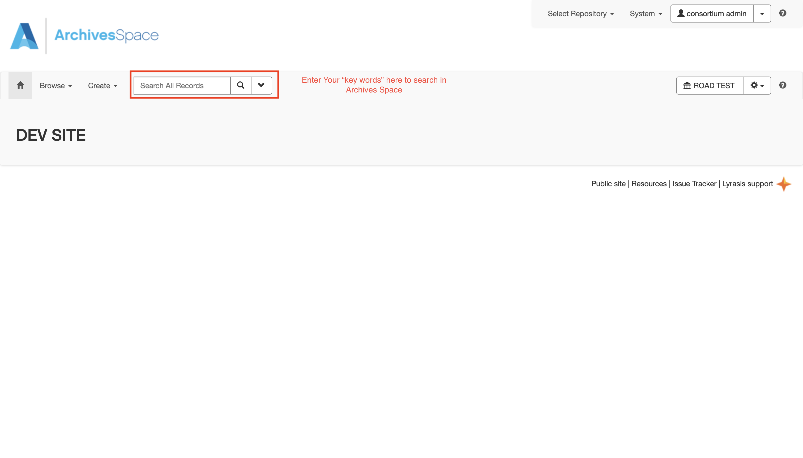

## 1.2.Viewing a Collection
To View a collections go to the far right and click the "view" button to expand on the chosen collection. The webpage will refresh and a new webpage will be shown that goes into  detail on the chosen collection
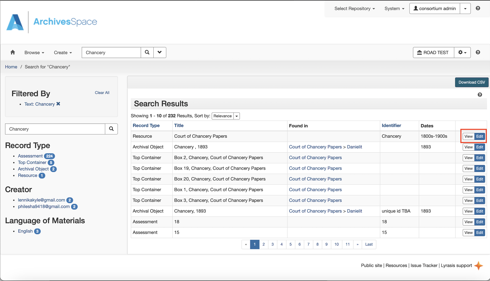

## 1.3.Editing a Collection
Click the "Edit" button above "Court of Chancery Papers" collection. Clicking edit give access to the interal details of the collection with the ability to manipulate, add and or change critical information.
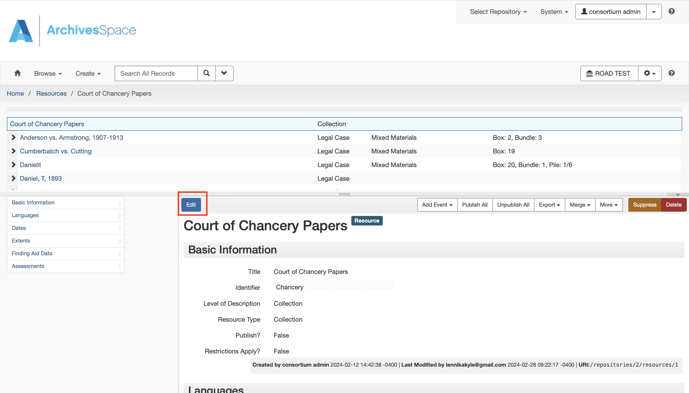

---

# 2.Making and Adding changes
## 2.1.Parent Child Relationships
The "Add Child" button adds a child to the collection. In this case "Cumberbatch vs Cutting" is added as a child to the parent collection which is "Court of Chancery Papers"
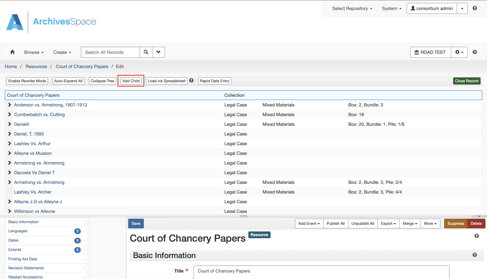

>The following touches on a concpet revolving around nesting information. This way it creates a hierarchial system within the collection. Here data and informtaion is organised in a parent-child relationship.
The parent sits at the top while the child sits below or sits inside of the parent

**Result:**
"Cumberbatch vs. Cutting" is created and stored in the "Court of Chancery Papers" collection thus creating the parent-child relationship.
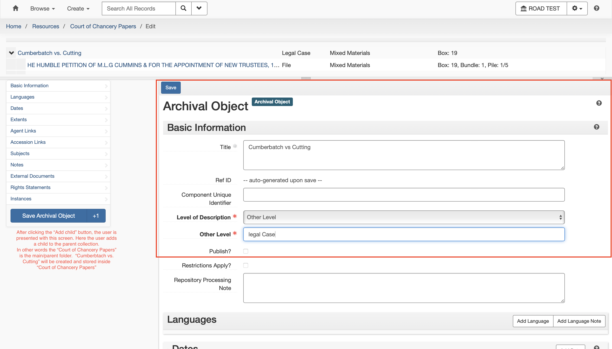

## 2.2.Basic Information
Basic information covers the the fist set of details that will be added to the newly created item. It gives a *basic* overview of the item in the collection

**1.Title:** The title text box is the first textbox of the newly craeted item. It provides a name for the item. Each archived object/item must have a title or a data subrecord
- In **Title** textbox add "Consent of proposed to trustree to the act affidavit verifying same , 1912"

**2.Reference Identifer:** An automatically provided and updatable reference ID

**3.Componenet Unique Indentifier:** Expresses a unique ID, within the context of the resource description, for the component part.

**4.Level of Description:** Indicates. the hierarchical level of the materials being described.
- In the **Level of Description** textbox add "Other Level" the dropdown
A textbox labeled **Other Level** will appear under **Level of Description**
- In the **Other Level** textbox type "Legal Case"

**4.Resource Type:** Determines what kind of item it is. (collection is chosen by default)
The item can be a 
- Collection
- Papers
- Publicaitons
- Records

### Publish?
Is the collection published or not
(it is not)

### Restrictions Apply?
Does the collection have restricted access

### Repository Processing Note
Any additional commints that will be added to the collection

# 2.2. Adding File to a Collection | Adding A Child to A Child to the collection
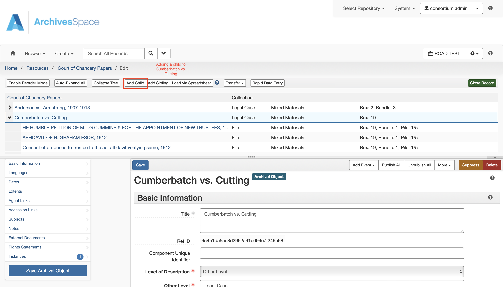
Here the file "Consent of proposed to trustree to the act affidavit verifying same , 1912" is being added as a child to the "Cumberbatch vs. Cutting" collection who now becomes its parent.

>Sinnce we are adding a child to "Cumberbatch vs. Cutting" colleciton. We can say that the "Cumberbatch vs Cutting" collection is the parent of the "Consent of proposed to trustree to the act affidavit verifying same , 1912" file.

---

# 3. Popultaing a File
The follwoing is an example of adding a file called "Consent of proposed to trustree to the act affidavit verifying same , 1912" to its parent collection "Cumberbtach vs. Cutting" which is a child of "Court of Chancery Papers"

After adding a "child" file to a "parent" collection, who is also a child to its own parent collection, we essentially have a child of a child a parent.

- **The Order of Importance:** *Parent* "Court of Chancery Papers" -> *Child* "Cumberbatch vs. Cutting" -> *Child* "Consent of proposed to trustree to the act affidavit verifying same , 1912"

## 3.1.Basic Information
Basic information covers the the fist set of details that will be added to the newly created item. It gives a *basic* overview of the item in the collection

**1.Title:** The title text box is the first textbox of the newly craeted item. It provides a name for the item. Each archived object/item must have a title or a data subrecord
- In **Title** textbox add "Consent of proposed to trustree to the act affidavit verifying same , 1912"

**2.Reference Identifer:** An automatically provided and updatable reference ID

**3.Componenet Unique Indentifier:** Expresses a unique ID, within the context of the resource description, for the component part.

**4.Level of Description:** Indicates. the hierarchical level of the materials being described.
- In the **Level of Description** textbox add "Other Level" the dropdown
A textbox labeled **Other Level** will appear under **Level of Description**
- In the **Other Level** textbox type "Legal Case"

**5.Publish:** Is the collection published or not?

**6.Restrictions Apply:** Does the collection have restricted access

**7.Repository Processing Note:** An application-specific field for recording information about processing of the materials.
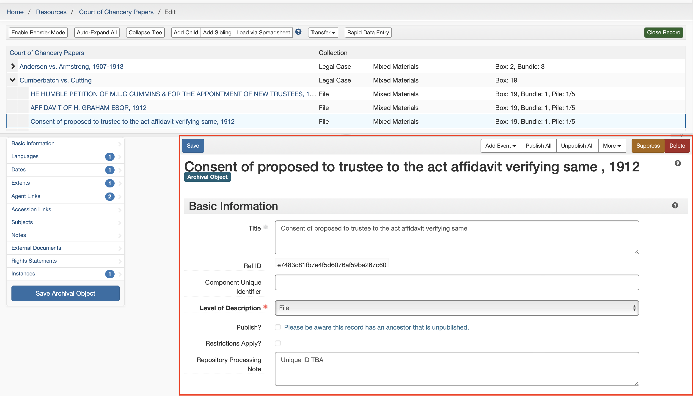

---

## 3.2.Languages
**1.Language:** Describes the language the collection is written/recorded in. 
- In the **Langugaes** textbox add "English"

**2.Scripts:** The Linga Franca or Family the language is apart of
- in the **Script** textbox add "Latin"
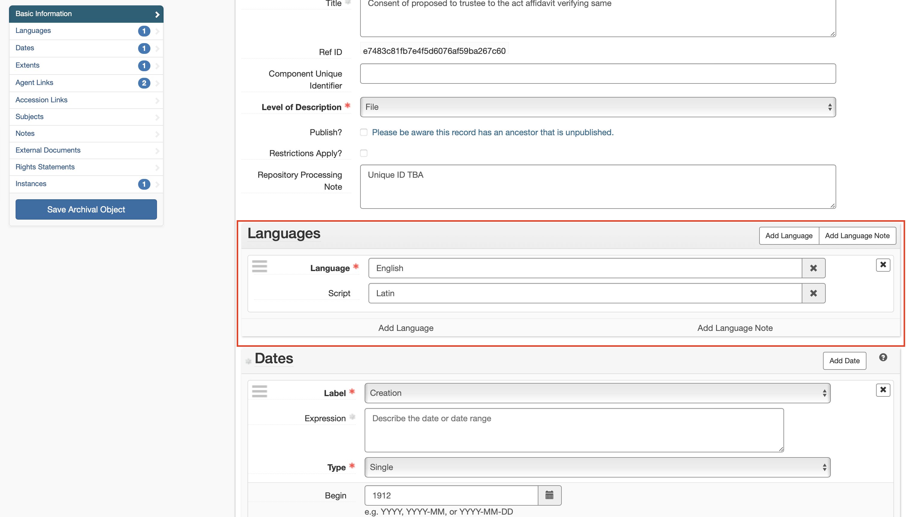

---

## 3.3.Dates
Applies a datae to the collection
**1.Label:** Describes what the type of activity the date signifies.
- select creation for the menu
**2.Expression:** Gives a dated range of the records in the collection

**3.Type:** Indicates the type for normalized date information, either a single date or a date range (inclusive or bulk)
- select "single or bulk dates"

**4.Begin and End:** When does the collection begin and when does it end 
- (YYYY-MM-DD) format

**5.Certainty:** The level of confidence for the information given in a date statement.
*How confident are you on the estimated date*
- select "approximate"

**6.Era:** Period during which years are numbered and dates reckoned, such as B.C. or C.E. The value "ce" is the default.
- select "ce" (common era)

**7.Calendar:** System of reckoning time, such as the Gregorian calendar or Julian calendar. The value "gregorian" is the default.
*Type of calendar to keep track of correct dates*
- select "gregorian"
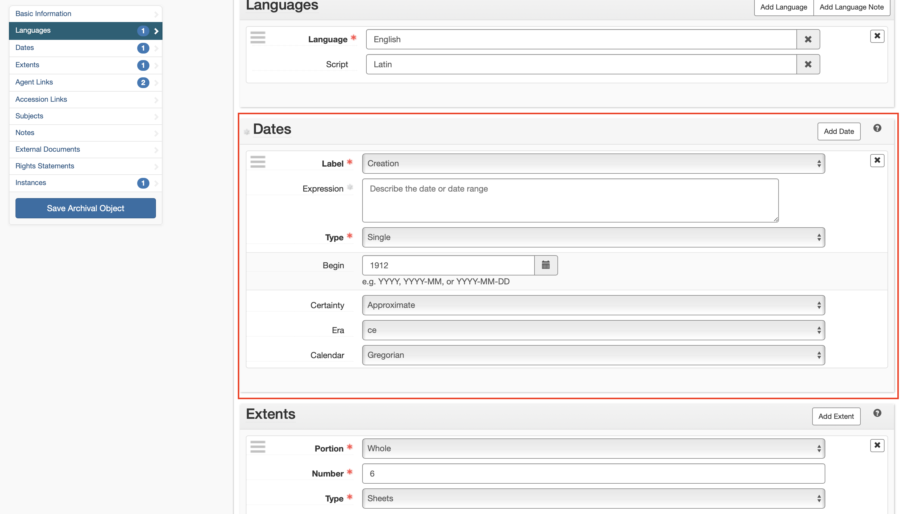

---

## 3.4.Extents
Indicates the extent and the physical nature of the materials being described.
*Physical properties of the Object*

**1.Portion:** Used to specify whether an extent statement relates to the whole or part of a given described aggregation or object.
- select whole

**2.Number:** A numeric value for indicating the number of units in the extent statement
*number of parts attached to the file*
- select 1(number of parts of file)

**3.Type:** A term indicating the type of unit used to measure the extent of materials described.
- select sheets

**4.Container Summary:** A list of container and container types housing the materials described in the component record.
- 2 parts
- 3 sheets
- 1 envelope
- (6 pages in total)

    Elements
    - 1 fastener NIP(not in place)
    - 1 Fragmented Envelope/Envelope

**5.Physical Details:** Other physical details of the materials described
*What type of material the collcetion contains or is made of*
- LAID paper
- Written
- Type or Print

**6.Dimension:** Dimensions of the materials described
>enter 30*20 cms
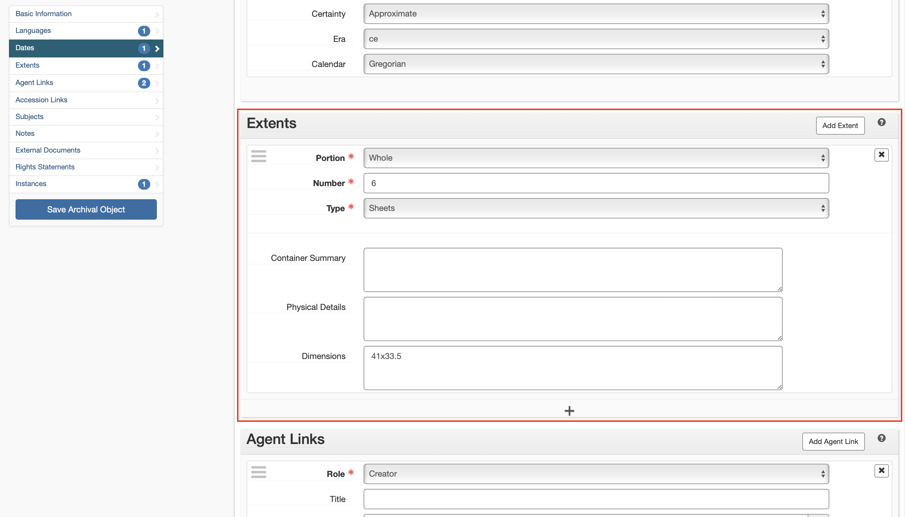

---

## 3.5.Agent links
Associates agents as a creator, source, or subject of the materials described to provide information about their context.
*Think of Agent links as the author(s) who edited the collection.*

**1.Role:** An indication of what function (creator, source, or subject) the Agent has in regards to its link to a certain description record
- select "Creator"

**2.Title:** Record here the authoritative title of a work in order to make a Name / Title heading for an agent linked as a creator or a subject:
*title of object you worked on*

**3.Realtor:** An indication of what role the Agent has in regards to its function as indicated in how it is linked (e.g., creator, source, or subject)
- select "conservator"

**4.Agent:** Who are the agents
- select agents who entered info on spreadsheet
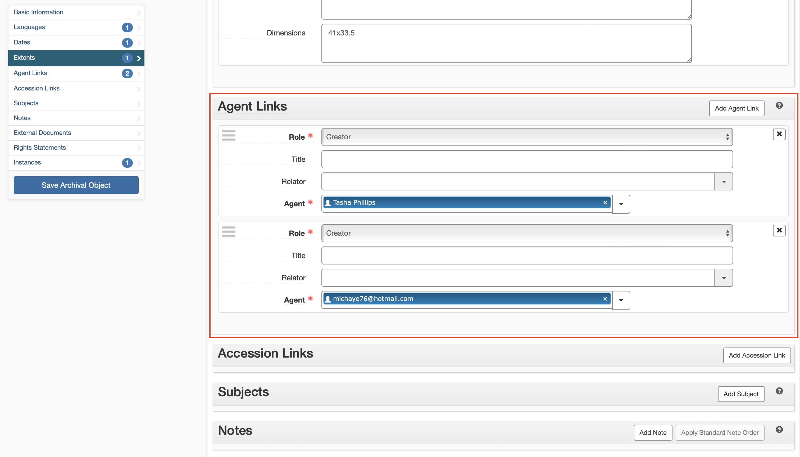

---

## 3.6.Notes 
Additional descriptive information about the materials described, usually in the form of text or structured lists.
**1.Notes Type:**
- from drop down menu select "Physical Location"
**2.Single Part Note**

**3.Persistent ID:**

**4.Lable:** A label or heading for the specific note

**5.Type:** The type of note for the content

**6.Publish:** Determines whether this Note to public

**7.Content:**
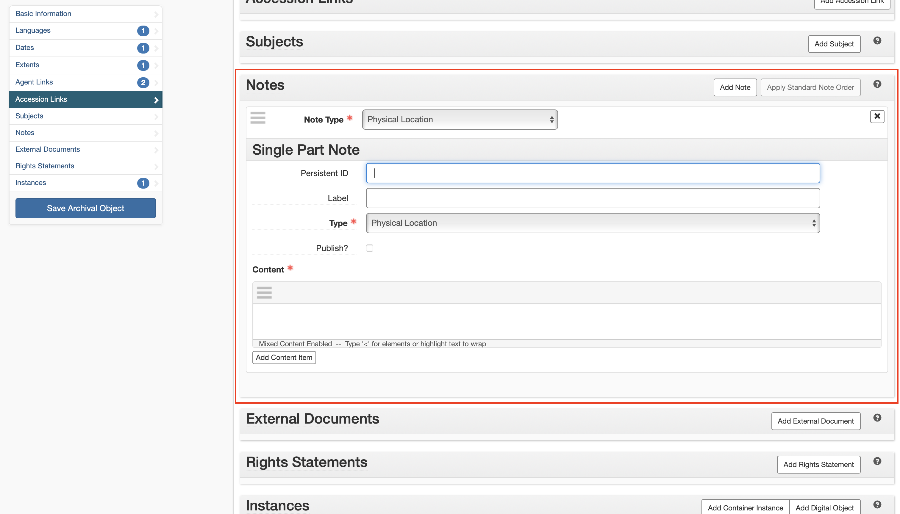

---

## 3.7.Instances
**1.Type:** A designation of the manifestation for the described materials
- select "mixed materials"

**2.Top Container:**
- select which box to use

**3.hild Type:** The type of the second-level container in which the described material is housed.
- select "bundle"

**4.Child Indicator:** An alphanumeric expression for indicating the ID of the second-level container, which may also indicate the second-level container's position within a sequence of such containers. 
- select "bundle number"

**5.Childer Container Barcode:** A barcode to identify the second-level container in which the described material is housed.

**6.Grandchild Type:** A barcode to identify the second-level container in which the described material is housed.
- select "pile"

**7.Grandchild Indicator:** An alphanumeric expression for indicating the ID of the third-level container, which may also indicate the second-level container's position within a sequence of such containers. 
- select "pile number"
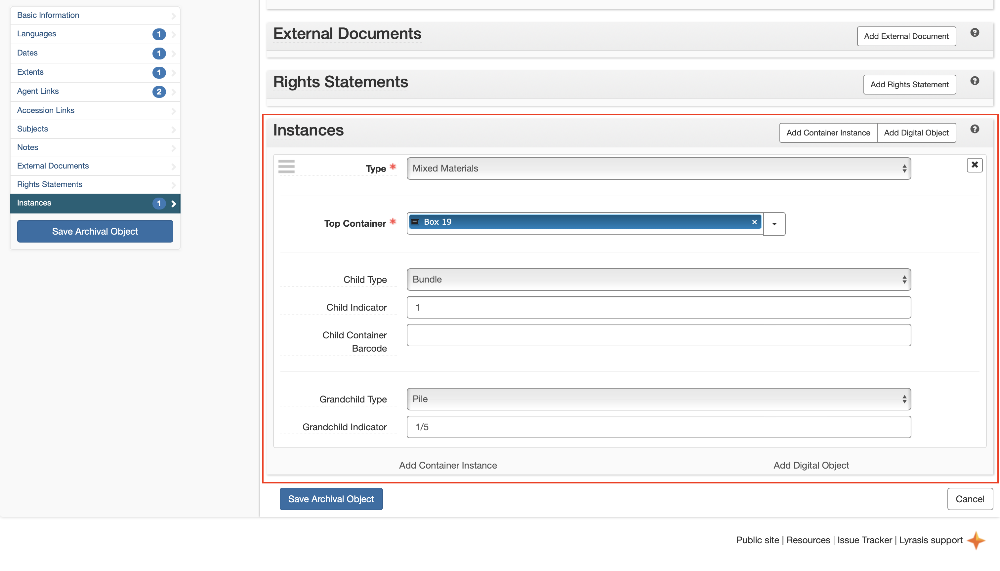